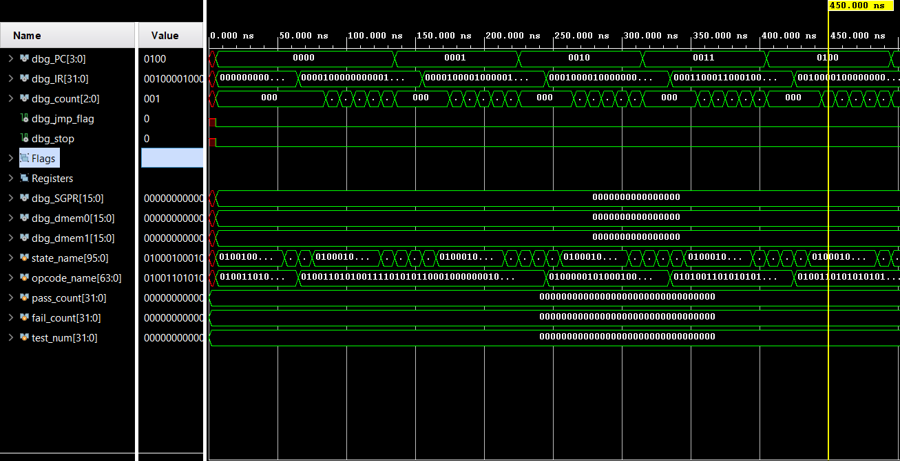
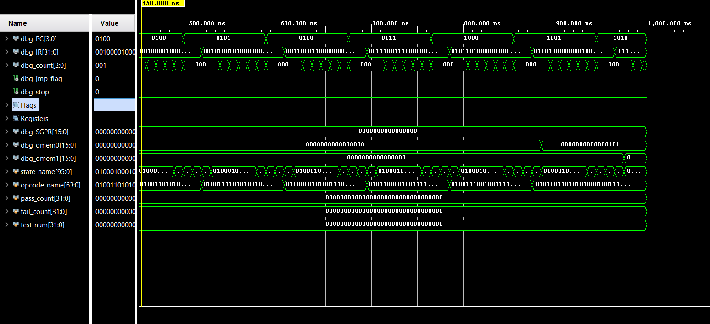

# Custom 16-Bit RISC Processor

A fully functional 16-bit Harvard Architecture RISC processor designed in Verilog, featuring a custom 25-instruction ISA with arithmetic, logical, memory, branching, and control operations.

## Architecture Overview

```
                    +------------------+
                    |   Instruction    |
                    |   Memory (16x32) |
                    +--------+---------+
                             |
                     +-------v-------+
        +----------->|  FSM Control  |<-----------+
        |            |   Unit (6-st) |            |
        |            +---+-------+---+            |
        |                |       |                |
   +----+----+     +-----v-----+ |  +-----------+|
   | Program  |     | Instruction| |  | Condition ||
   | Counter  |     |  Decoder   | |  |   Flags   ||
   | (4-bit)  |     +-----+-----+ |  +-----------+|
   +----------+           |       |                |
                    +------v------+                |
                    |     ALU     +----------------+
                    | (16-bit ops)|
                    +------+------+
                           |
                    +------v------+      +----------+
                    | Register    |      |   Data   |
                    | File (32x16)|<---->|  Memory  |
                    +-------------+      | (16x16)  |
                                         +----------+
```

| Feature | Specification |
|---------|--------------|
| Architecture | Harvard (separate instruction/data memory) |
| Data Width | 16-bit |
| Instruction Width | 32-bit |
| Register File | 32 x 16-bit GPRs + 1 SGPR |
| Instruction Memory | 16 x 32-bit |
| Data Memory | 16 x 16-bit |
| Condition Flags | Sign, Zero, Carry, Overflow |
| Control | 6-state FSM (Mealy) |
| Clock | Single clock, positive-edge triggered |
| Reset | Synchronous, active-high |

## Instruction Set Architecture (ISA)

### Instruction Format (32-bit)

```
[31:27]  [26:22]  [21:17]  [16]      [15:11]   [10:0]
opcode    rdst     rsrc1   imm_mode   rsrc2    imm_lower
  5-bit   5-bit    5-bit    1-bit     5-bit     11-bit
```

### Supported Instructions

| Opcode | Mnemonic | Operation |
|--------|----------|-----------|
| 00000 | MOVSGPR | GPR[rdst] = SGPR |
| 00001 | MOV | GPR[rdst] = imm / GPR[rsrc1] |
| 00010 | ADD | GPR[rdst] = GPR[rsrc1] + operand |
| 00011 | SUB | GPR[rdst] = GPR[rsrc1] - operand |
| 00100 | MUL | {SGPR, GPR[rdst]} = GPR[rsrc1] * operand |
| 00101 | OR | GPR[rdst] = GPR[rsrc1] \| operand |
| 00110 | AND | GPR[rdst] = GPR[rsrc1] & operand |
| 00111 | XOR | GPR[rdst] = GPR[rsrc1] ^ operand |
| 01000 | XNOR | GPR[rdst] = GPR[rsrc1] ~^ operand |
| 01001 | NAND | GPR[rdst] = ~(GPR[rsrc1] & operand) |
| 01010 | NOR | GPR[rdst] = ~(GPR[rsrc1] \| operand) |
| 01011 | NOT | GPR[rdst] = ~operand |
| 01101 | STOREREG | data_mem[addr] = GPR[rsrc1] |
| 01110 | STOREDIN | data_mem[addr] = din |
| 01111 | SENDDOUT | dout = data_mem[addr] |
| 10001 | SENDREG | GPR[rdst] = data_mem[addr] |
| 10010 | JUMP | PC = target (unconditional) |
| 10011 | JCARRY | Jump if carry flag set |
| 10100 | JNOCARRY | Jump if carry flag clear |
| 10101 | JSIGN | Jump if sign flag set |
| 10110 | JNOSIGN | Jump if sign flag clear |
| 10111 | JZERO | Jump if zero flag set |
| 11000 | JNOZERO | Jump if zero flag clear |
| 11001 | JOVERFLOW | Jump if overflow flag set |
| 11010 | JNOOVERFLOW | Jump if overflow flag clear |
| 11011 | HALT | Stop execution |

## FSM Control Unit

```
IDLE --> FETCH --> DECODE/EXECUTE --> DELAY (x5) --> NEXT_PC --> SENSE_HALT
  ^                                                                  |
  +----------------------------(if not halted)----------------------+
```

## Project Structure

```
custom_processor/
├── README.md
├── custom_processor.xpr              # Vivado project file
└── custom_processor.srcs/
    ├── sources_1/new/
    │   ├── define.vh                  # ISA opcode & field macros
    │   ├── top.v                      # Processor top module
    │   └── data.mem                   # Test program (binary)
    └── sim_1/new/
        └── tb.v                       # Self-checking testbench
```

## Verification Test Suite (23 Tests)

The included `data.mem` program and `tb.v` testbench automatically execute and verify **23 distinct hardware tests**:

### 1. Arithmetic & Logical Operations
- **Test 1-2**: `MOV` (Immediate load)
- **Test 3**: `ADD` (Register addition)
- **Test 4**: `SUB` (Register subtraction)
- **Test 5**: `MUL` (Lower 16-bit result)
- **Test 6-9**: `OR`, `AND`, `XOR`, `NOT` (Bitwise logic)

### 2. Memory Operations
- **Test 10**: `SENDREG` (Load from memory to register)
- **Test 13-14**: `STOREREG` (Store register to memory locations 0 and 1)

### 3. Control Flow & Branching
- **Test 11**: `MOV R10, #0` (Intentional zero generation)
- **Test 12**: `JZERO` (Conditional branch validation — verifies an instruction was skipped)
- **Test 19**: `HALT` (Verifies the processor stops execution)

### 4. Condition Flags & Special Registers
- **Test 15**: Zero Flag (Asserts flag is set when result is 0)
- **Test 16-18**: Sign, Carry, Overflow Flags (Asserts flags are cleared correctly)
- **Test 20**: `SGPR` (Verifies upper 16-bits of `MUL` are stored in the Special Purpose Register)

### 5. Hardware Reset Integrity
- **Test 21**: Program Counter resets to `0`
- **Test 22**: `stop` control signal clears
- **Test 23**: `jmp_flag` control signal clears

## How to Run

### Vivado Simulation

1. Open `custom_processor.xpr` in Xilinx Vivado
2. Click **Run Simulation → Run Behavioral Simulation**
3. In the Tcl console, type: `run all`
4. View results in the Tcl console and waveform viewer
5. In the waveform, expand **tb** scope to see debug signals (`dbg_PC`, `dbg_state`, `dbg_R0`–`dbg_R11`, `dbg_flags`, etc.)

### Expected Console Output

```
=======================================================
  Custom Processor - Verification Testbench
=======================================================

  RESULTS: 23 PASSED, 0 FAILED (out of 23 tests)
  *** ALL TESTS PASSED ***
=======================================================
```

### Simulation Waveform

*Since the full simulation is too detailed to fit cleanly in one picture, here is the waveform split into two clear sections:*

<p align="center">
  
  <br><i>Part 1: Initial reset, MOV, ADD, SUB, and MUL instructions</i>
</p>

<p align="center">
  
  <br><i>Part 2: Logical operations, Memory Stores, and Condition Branching</i>
</p>

> **Note:** The `GPR` and `Flag` registers have been grouped to maintain a clean layout while showing exactly how the processor executes each instruction cycle-by-cycle.

## Tools Used

- **HDL**: Verilog (IEEE 1364-2001)
- **IDE**: Xilinx Vivado 2020.2
- **Simulator**: Vivado XSim
- **Target**: Behavioral simulation (FPGA-synthesizable RTL)

## Key Design Highlights

- Clean separation of combinational (next-state) and sequential (register update) logic
- No latch inference — all registers driven from clocked `always@(posedge clk)` blocks
- Single-driver discipline — every signal has exactly one driver
- Proper synchronous reset initializing all 32 GPRs, flags, PC, and data memory
- Blocking intermediates (`alu_result`, `mul_res`) for correct flag computation within sequential blocks
- Self-checking testbench with 23 automated tests and debug wire probes for waveform analysis
